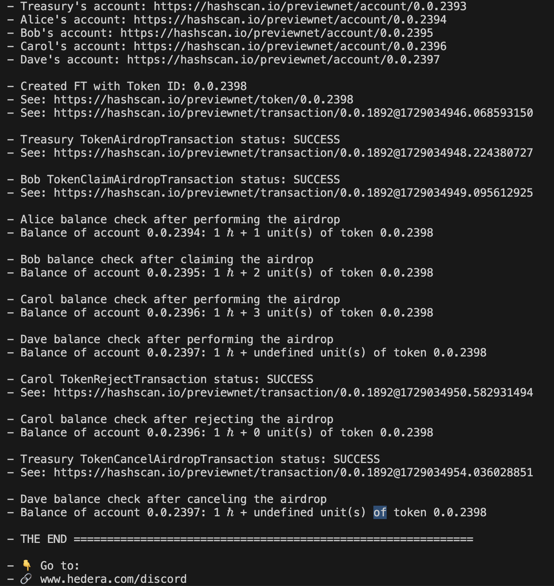

# Airdrop, Claim, Reject, and Cancel HTS Tokens (HIP-904) with the JS SDK

This example demonstrates how to use the new **HTS Airdrop** feature introduced in **Hedera Improvement Proposal (HIP-904)**. This feature simplifies the process of airdropping both fungible and non-fungible tokens by removing the need for the receiver to pre-associate with a token. It also allows the sender to pay for token associations and supports options for claiming, rejecting, or canceling airdrops.

## How to Run

After cloning the `hedera-code-snippets` repo, navigate to the airdrop example folder:

```
cd airdrop-claim-reject-cancel-hts-token-js-sdk
```

Install dependencies:

```
npm install
```

Copy the `.env.sample` file and rename it to `.env`:

```
cp .env.sample .env
```

Run the aridrop example:

```
node airdrop.js
```

### Console Output



## Features Demonstrated

1. **Account Creation**: Creates multiple accounts (Treasury, Alice, Bob, Carol, and Dave) using `AccountCreateTransaction` to simulate airdrop scenarios.
2. **Token Creation**: Creates a new token on Hedera using `TokenCreateTransaction`.
3. **Token Airdrop**: Demonstrates how to perform a token airdrop using `TokenAirdropTransaction`.
4. **Airdrop Claiming**: Shows how a recipient (Bob) can claim a pending airdrop using `TokenClaimAirdropTransaction`.
5. **Airdrop Rejection**: Demonstrates how a recipient (Carol) can reject an airdrop using `TokenRejectTransaction`.
6. **Airdrop Cancellation**: Illustrates how the sender (Treasury) can cancel a pending airdrop using `TokenCancelAirdropTransaction`.
7. **Balance Checks**: Queries account balances after airdrop transactions to verify results.

## Flow Overview

1. **Set Up**:

   - Load credentials and connect to the Hedera network.
   - Create accounts for Treasury, Alice, Bob, Carol, and Dave.

2. **Token Creation**:

   - Treasury creates a token and becomes the token administrator.

3. **Airdrop Tokens**:

   - Treasury airdrops tokens to Alice, Bob, Carol, and Dave.

4. **Bob Claims Airdrop**:

   - Bob claims his airdropped tokens successfully.

5. **Carol Rejects Airdrop**:

   - Carol rejects her airdropped tokens, sending them back to the Treasury.

6. **Cancel Airdrop for Dave**:

   - Treasury cancels Dave's pending airdrop.

7. **Balance Checks**:
   - Check balances for all accounts to reflect the result of claims, rejections, and cancellations.

This script showcases the key elements of the HTS Airdrop flow with support for claiming, rejecting, and canceling pending transfers. For more details on HIP-904, visit the [HIP-904 proposal](https://hips.hedera.com/hip/hip-904).
