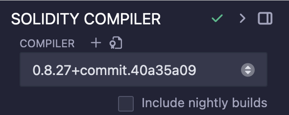

# Mint ERC20 Token to EVM address using Remix IDE and Hedera Smart Contracts Service

This code snippet aims to show users how to easily deploy, mint and transfer ERC-20 Tokens to any ethereum address via the help of OpenZeppelin, Remix and a new smart contract on the Hedera network.


## Prerequisites

You will need to use Remix IDE to compile the Token.sol contract and to retrieve the bytecode.

1. Head to https://remix.ethereum.org
2. Copy Token.sol into the contracts directory:

3. Head to the Solidity Compiler:

4. Make sure to chose the right version (same as Token.sol):

5. Compile the code
6. Copy bytecode:


To see the mint the Tokens, you will need an EVM address, and to see them you'll need a wallet like Metamask.


## How to

### Deploying a contract:

1) Rename .env.example to .env

2) Update the .env file with a BYTECODE (from Prerequisites), OPERATOR_ID and OPERATOR_KEY. 

3) Run this command to deploy the contract:
```
node deployERC20.js
```


### Minting Tokens to Wallet:

1) Update the .env file with CONTRACT_ID (retrieved from prev. deployment) and RECIPIENT_ADDRESS.

2) Run this command to mint the tokens to the wallet:
```
node mintTokensToWallet.js
```

3) to see the tokens in your Metamask wallet, you need to import the token. Navigate to Metamask and click "Import Token":


4) Past in the Token contract EVM address (can be found in Hashscan)

5) Give the Token a name (here: HTT) and see them appear in your wallet.


## Code


See `deployERC20.js`

Deploys a smart contract onto the Hedera Testnet.


See `mintTokensToWallet.js`

Mints a certain amount of tokens (default: 100) to an EVM address of your choice. 


#### Example output

In the terminal, after successfully deploying a contract:
```
The smart contract ID is: xxxxxx
```

In the terminal after successfully minting tokens to wallet:
```
Minting transaction status: SUCCESS
```


## References

- [Deploy Smart Contract Docs](https://docs.hedera.com/hedera/tutorials/smart-contracts/deploy-your-first-smart-contract)